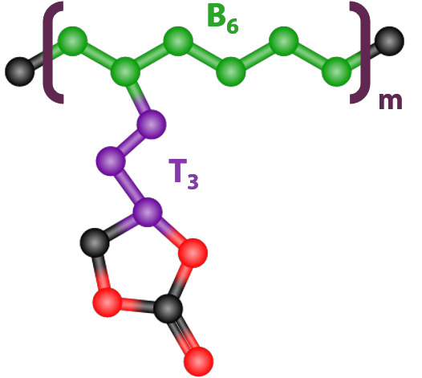

# Data

This folder contains the data used for machine learning. It does not include any raw MD trajectories.

The folder titled `individual` lists the featurized data for all 12 simulation systems as extensionless text files. `parsed_data.csv` is all the data in a single CSV file, complete with column names. This is the data file used in all the notebooks. `conductivity.csv` simply lists the ionic conductivity of each of the 12 systems, in units of mS/cm. `12_system_summary.csv` lists the average value of all 12 features for a given system as well as the system's corresponding ionic conductivity value.

Each simulation system is named according to the poly(alkyl ethylene carbonate) (PAEC) monomer. PAEC monomer names take the form “BnTm”, where “Bn” refers to *n* number of backbone carbons, and “Tm” refers to *m* number of carbons on the tether connecting the EC group to monomer backbone. The naming convention is illustrated below for “B6T3”.

  

